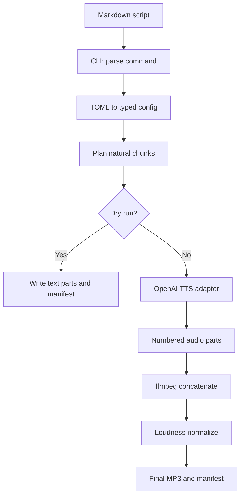

# Stage 1 walkthrough: script to local MP3

Stage 1 is a synchronous local pipeline. One CLI process reads a script, divides it into safe TTS
requests, generates numbered audio parts, combines them, normalizes the result, and writes a
manifest. The design is deliberately small enough to understand end to end while preserving the
boundaries needed for later cloud execution.

## The complete flow



## 1. Packaging creates the command

`pyproject.toml` describes the package, dependencies, supported Python version, developer tools,
and console entry point:

```toml
[project.scripts]
commute-podcast = "commute_podcast.cli:main"
```

After `uv sync`, running `uv run commute-podcast` calls `main()` in `cli.py`. This means the shell
command is a thin entry point into ordinary testable Python rather than a standalone shell script.

**What to learn:** package metadata, virtual environments, dependency locking, and console scripts.

## 2. The CLI handles user interaction

`cli.py` uses `argparse` to expose two commands:

- `plan`: analyze without writing audio or using the paid API;
- `generate`: create artifacts, with `--dry-run` as a safe rehearsal.

The CLI loads configuration, reads the script, rejects empty input, selects a provider, delegates
generation, and prints structured JSON. It does not know how to call OpenAI or combine audio.

That separation matters: the future MCP server and cloud worker can call the same orchestration
function without pretending to be terminal commands.

**Trace exercise:** follow `uv run commute-podcast generate examples/pilot.md --dry-run` from
`_parser()` to `main()` to `generate_episode()`.

## 3. TOML becomes typed configuration

`config.py` reads `podcast.toml` with the standard-library `tomllib` module. Frozen dataclasses
represent four groups:

| Dataclass | Responsibility |
| --- | --- |
| `ShowConfig` | show name and author |
| `VoiceConfig` | provider, model, voice, output format, delivery instructions |
| `GenerationConfig` | target/hard chunk limits and output directory |
| `AudioConfig` | loudness-normalization behavior |

`AppConfig` aggregates them. `load_config()` validates that chunk sizes are positive and that the
soft target does not exceed the hard maximum. It also resolves a relative output path against the
configuration file, avoiding dependence on whichever directory launched the process.

**Why frozen dataclasses?** Configuration is created once and should not drift halfway through an
episode. Immutability makes that expectation visible.

## 4. Chunking protects quality and request limits

Long narration is not sent as one request. `chunk_script()` applies boundaries from strongest to
weakest:

1. Blank lines identify paragraphs.
2. Oversized paragraphs split on sentence-ending punctuation.
3. An oversized sentence falls back to word boundaries.
4. Smaller units are packed toward `target_chunk_characters`.
5. No returned unit should exceed `max_chunk_characters`.

The target is a quality/efficiency preference. The maximum is a safety invariant. Keeping them
separate prevents awkward tiny requests while still enforcing a ceiling.

One limitation to revisit: the sentence regex recognizes `.`, `!`, and `?`, but does not understand
abbreviations such as “e.g.” or richer Markdown structure. Version 0.3 should add adversarial
examples before making the parser more sophisticated.

## 5. The provider protocol creates a seam

`providers/base.py` defines the behavior orchestration needs:

```python
class SpeechProvider(Protocol):
    def synthesize(self, text: str, destination: Path, config: VoiceConfig) -> None: ...
```

This is structural typing: a class does not need to inherit from a base class; it only needs the
required method. `episode.py` depends on this small contract, not on the OpenAI SDK.

`OpenAITTSProvider` is the adapter that translates the project's `VoiceConfig` into an OpenAI SDK
request. Its constructor checks that `OPENAI_API_KEY` exists but never reads it into a manifest or
prints it. The SDK obtains the value from the process environment.

The streaming response writes directly to a destination file. That avoids holding the entire
audio response in memory, which becomes increasingly important for longer episodes.

## 6. The orchestrator owns the episode workflow

`generate_episode()` is the current application service:

1. Chunk the script.
2. Reject empty content.
3. Convert the title into a filesystem-safe slug.
4. Create `episodes/<slug>/`.
5. Write each chunk as `part-NNN.txt` for inspection.
6. Generate `part-NNN.mp3` only when it does not already exist.
7. Combine parts into `episode.mp3`.
8. Copy the finished file to `episodes/<slug>.mp3`.
9. Write `manifest.json`.

The existence check provides elementary resumability: if chunk three fails, chunks one and two can
remain and be reused. It is intentionally simple, but not yet production-grade. A truncated file
could exist and be incorrectly treated as complete. Version 0.3 will use atomic temporary files,
validation, checksums, and explicit job state.

## 7. ffmpeg assembles and normalizes audio

`audio.py` verifies that `ffmpeg` is on `PATH`, writes a concat-list file, and invokes `ffmpeg` with
an argument list rather than a shell command string. Avoiding `shell=True` reduces quoting bugs and
command-injection risk.

The current output uses:

- MP3 with the `libmp3lame` encoder;
- 160 kbps audio bitrate;
- EBU R128 `loudnorm` targeting -16 LUFS;
- true-peak target of -1.5 dBTP;
- loudness range target of 11 LU.

Normalization aims for consistent perceived volume during a commute. It does not improve bad
pronunciation or unnatural pacing; those remain TTS and script-quality problems.

## 8. The manifest is the beginning of observability

Each run records title, show, timestamp, dry-run flag, counts, estimated duration, voice settings,
and final output path. This supports troubleshooting and will evolve into the cloud job record.

The current estimate divides word count by 150 words per minute. It is useful for planning but not
an audio measurement. Version 0.3 should record actual media duration and generation latency.

## 9. Explicit job state makes progress visible

`job.py` defines the `EpisodeJob` model and its `JobStatus` values:

```text
planned → synthesizing → assembling → completed
                 └────────────────────────────→ failed
```

The orchestrator owns these transitions. It creates a planned job after chunking, marks the job as
synthesizing while producing parts, marks it as assembling before invoking `ffmpeg`, and marks it
completed after the final MP3 is copied. Exceptions transition an in-progress job to failed before
the error is re-raised. The final manifest includes the job title, slug, chunk count, and status.

This is deliberately a small state machine: valid transitions are explicit, and impossible jumps
such as `planned` directly to `assembling` raise an error. The next resilience slice will persist
intermediate state during execution so a failed job can be inspected and resumed, rather than only
recording the final successful state.

## 10. Tests define today’s guarantees

The unit tests currently prove:

- paragraph content and order survive chunking;
- chunks respect the hard maximum;
- invalid chunk settings are rejected;
- the default configuration resolves correctly;
- titles become safe slugs;
- dry runs produce a manifest without a provider;
- episode jobs follow only valid state transitions.

They do not yet prove provider authentication, API response handling, `ffmpeg` output validity,
interruption recovery, or actual loudness. Those gaps deliberately become Version 0.3 objectives.

## Data produced by one episode

```text
episodes/
├── pilot-episode/
│   ├── part-001.txt
│   ├── part-001.mp3
│   ├── part-002.txt
│   ├── part-002.mp3
│   ├── concat.txt
│   ├── episode.mp3
│   └── manifest.json
└── pilot-episode.mp3
```

These are runtime artifacts and are ignored by Git. The source script remains in `examples/` or
another intentional source directory.

## Stage 1 comprehension checklist

- [x] I can explain why CLI, orchestration, provider, configuration, and audio processing are separate modules.
These are all separate modules so that they can change independently, and this will allow for better organization of the repo and the code structure.
- [ ] I can trace both `plan` and `generate` without guessing.
Yes, this is simple. I already did it.
- [x] I can explain target versus maximum chunk size.
target shoots for a reasonable chunk but if its not a natural split (mid-paragraph) it will try to take on more but should still not overcome the max character count
- [x] I can explain how `Protocol` enables a second TTS provider.
this is basically just an adapter so that any dto can be migrated to a centralized data model/canonical structure
- [x] I can explain why the current resume mechanism is useful but incomplete.
current resume mechanism is not super deterministic and does not show exactly where in each step we left off and also doesnt project many different edge case failures
- [x] I can explain what `ffmpeg` does that the TTS provider does not.
ffmpeg is for audio normalization and stitching many smaller audio files together. also there is some codec/encoding capabilities involved that arent Directly available in the TTS provider
- [x] I can identify which tests are unit tests and what integration tests are still missing.
Most of the unit tests are basic functionality unit tests, and there are some config and state machine tests as well, but this is missing full end-to-end tests, and all of the cloud functionality and architectural stuff is still missing there.
- [x] I can describe what must change before this becomes a reliable cloud worker.
There's still a lot from the architecture and storage and state tracking part that still needs to be worked out. Also, the architecture isn't built for a full cloud workflow.
